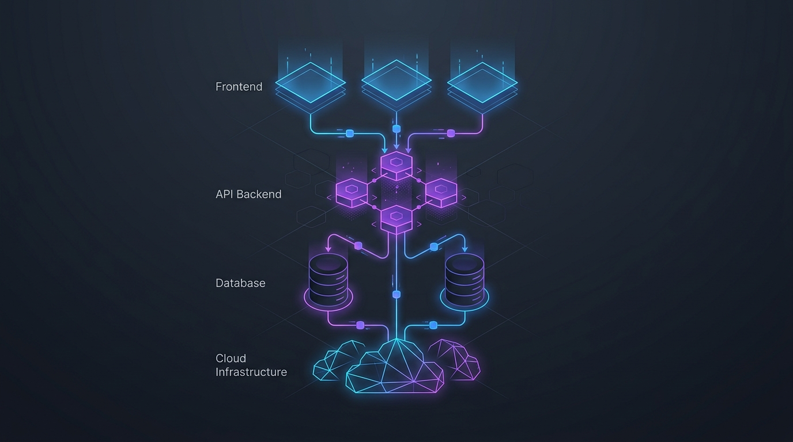

<!-- Banner Image Placeholder -->

  

 

# Hi, I'm Hisham 👋

I'm a **Full Stack Engineer** specializing in modern TypeScript applications, cloud infrastructure, and performance-focused engineering. I build robust systems, design efficient architectures, and enjoy moving beyond standard frontend work into deep infrastructure and developer tooling.

---

### 🧠 Developer Philosophy

I believe in understanding how systems work under the hood, rather than just making them work. 

- **Build:** Construct resilient, scalable applications using modern primitives.
- **Measure:** Base optimizations on real data and profiling, not guesswork.
- **Investigate:** Dive deep into source code, network layers, and execution contexts.
- **Optimize:** Eliminate bottlenecks in data fetching, state updates, and infrastructure.
- **Automate:** Treat infrastructure as code and eliminate manual workflows.

---

### 💻 Tech

  

 

<!-- Architecture Diagram Placeholder -->

  

 

---

### ⚙️ What I Work On

- **Production Systems:** Building robust payment processing, billing platforms, and third-party vendor integrations.
- **AWS Serverless Architectures:** Designing distributed Event-Driven Architectures (SQS, EventBridge, Lambda) for high-volume environments.
- **Infrastructure & CI/CD:** Migrating infrastructure, resolving configuration drift, and setting up reliable deployment pipelines.
- **Performance Optimization:** Tuning high-volume Lambda systems, API latency reduction, and database query optimization.
- **Reliability:** Cloud networking (VPC), IAM security, monitoring, and production troubleshooting.

---

### 🏗️ Selected Projects

#### [Sky Movie](#) 
*Local-first desktop application designed around offline/local media consumption.*
`Electron` `React` `TypeScript` `Vite` `Tailwind CSS` `SQLite`
- Explores local-first principles over standard cloud-synced paradigms.
- Focuses on efficient local data management and responsive UI without network dependency.

#### 🔭 In Progress / Exploring
- **Developer Tooling:** Creating utilities to help developers navigate and index massive codebases.
- **Repository Indexing:** Researching faster ways to parse, understand, and search abstract syntax trees.
- **Data Efficiency:** Exploring compression concepts focused on optimized reading, storage, and minimal token usage for AI contexts.
- **Offline-First Apps:** Experimenting with CRDTs, Supabase, and PWA synchronization mechanisms for seamless split-expense applications.

---

### 🔭 Engineering Interests

- 💻 **Development:** Full-Stack Development • Frontend Engineering • Backend Development
- 🛠️ **Technologies:** React & Next.js • TypeScript • API Design & Integrations
- ☁️ **Cloud & DevOps:** Cloud & Serverless Architecture • AWS • Infrastructure as Code • DevOps & CI/CD
- 🏗️ **Architecture:** System Design • Database Design • Scalable & Reliable Systems
- ⚡ **Engineering Excellence:** Performance Optimization • Developer Experience (DX) • Open Source

---

### 📊 GitHub Activity

  
  

 

  <!-- GitHub Snake Animation -->
  

---

### 📬 Connect

[GitHub](https://github.com/hisham-pp) • [LinkedIn](https://linkedin.com/in/hishampp) • [Email](mailto:hishammuhammed.in@gmail.com)

 

  
<i>Design scalable architectures. Master the primitives. Optimize relentlessly.</i>

   
  

